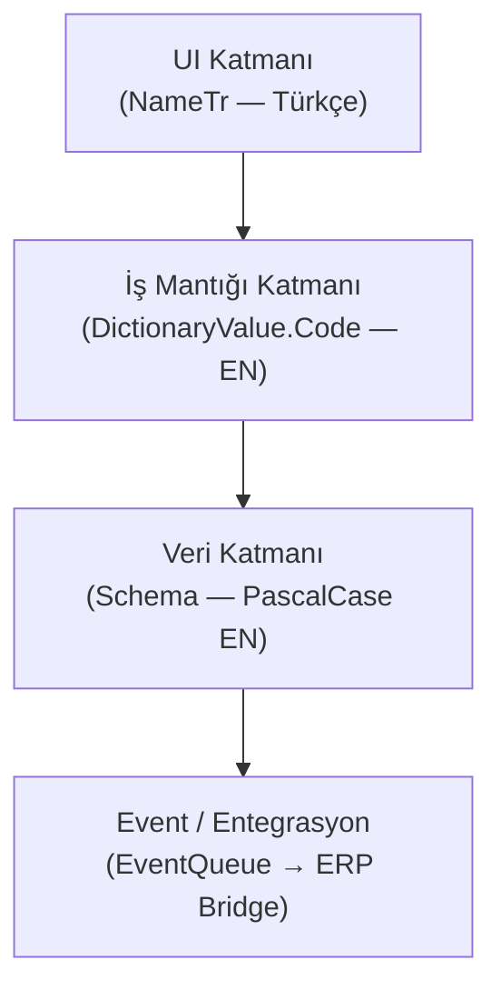
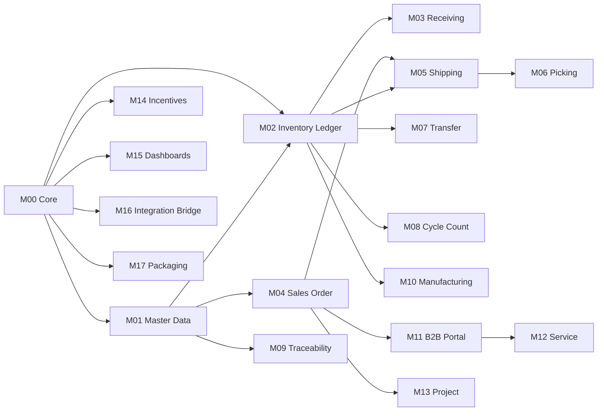

# OPERAX Platform — Detaylı Analiz ve Uygulama Planı

> **Kaynak Döküman:** `OPERAX_Platform_Master_Document_v2_2_TR.docx`
> **Sürüm:** v2.2-TR | **Analiz Tarihi:** Mart 2026

---

## 1. Dökümanın Özü — Ne İnşa Ediliyor?

OPERAX, sıfırdan başlayan bir şirketin kademeli olarak tam bir **WMS + Üretim + Ticari** platforma evrilebileceği **modüler, lisanslanabilir bir operasyon yazılım ailesidir.** Her modül bağımsız kurulabilir ve şirket bazlı aktif edilir.

**Temel tasarım kararları:**

| Karar | Açıklama |
|---|---|
| **Hard-code yasağı** | Durum/tip/birim/geçiş tanımları koda gömülmez; sözlük/parametre tablolarındadır |
| **Tek stok gerçeği** | Tüm fiziksel stok hareketleri `StockMovement` (Inventory Ledger) defterine yazılır |
| **Hücresel WMS** | Stok Warehouse bazında değil `Location` (bin) bazında tutulur |
| **UOM standardı** | Base UOM = **EACH** (adet); PACK/CASE okunsa bile deftere EACH adet yazılır |
| **Kısmi sevk** | `SalesOrderLine` satırları birden fazla Shipment ile kademeli kapanabilir |
| **Event-driven entegrasyon** | ERP bağlantısı `EventQueue` + retry + idempotency üzerinden gerçekleşir |
| **İsimlendirme üçlüsü** | Schema=İngilizce PascalCase, Code=İngilizce sabit, UI=Türkçe (NameTr/NameEn) |

---

## 2. Mimari Katmanlar



### Belge Yaşam Döngüsü (Tüm Modüller İçin Aynı)
1. Belge oluşturulur → **DRAFT**
2. Satırlar girilir, validasyon yapılır
3. Onay → **POSTED** *(stok etkisi + EventQueue burada üretilir)*
4. Gerekirse → **CANCELLED** / geri alma
5. Tüm etkiler `StockMovement` ve/veya `EventQueue` ile kayıt altına alınır

---

## 3. Temel Altyapı (Platform Core — M00)

Platform Core olmadan hiçbir modül çalışmaz. Zorunlu çekirdeği oluşturur:

| Tablo | Amacı |
|---|---|
| `Company` | Multi-company organizasyon |
| `User`, `Role`, `UserRole` | Kimlik ve yetki |
| `Module`, `ModuleDependency`, `CompanyModule` | Modül aktivasyon kataloğu |
| `DictionaryType`, `DictionaryValue` | Tüm tip/durum/birim tanımları |
| `StatusTransition` | Belge bazlı durum geçiş kuralları |
| `Parameter` | Şirket+modül bazlı davranış ayarları |
| `AuditLog` | Denetim izi |
| `EventQueue`, `Idempotency`, `ErrorQueue` | Entegrasyon altyapısı |

---

## 4. Modül Kataloğu — Detaylı Özet

### 4.1 Zorunlu Modüller (Her Kurulumda Olmalı)

| Modül | Ne Çözer | Ana Tablolar |
|---|---|---|
| **M00 — Platform Core** | Altyapı: kimlik, yetki, sözlük, parametre, queue | Company, User/Role, Dictionary, StatusTransition, EventQueue |
| **M01 — Master Data** | Ürün/müşteri kartları, UOM/barkod standardı | Item, Account, Warehouse, Location, UOM, ItemUOM, ItemBarcode |
| **M02 — Inventory Ledger** | Tek stok defteri, bakiye takibi | StockMovement, InventoryBalance, Reservation, InventorySnapshot |

### 4.2 Ops Modülleri (WMS Çekirdeği)

| Modül | Ne Çözer | Faz | Bağımlılık | Ana Tablolar |
|---|---|---|---|---|
| **M03 — Receiving** | Disiplinli mal kabul | Ph1-3 | M00+M01+M02 | Receiving, ReceivingLine, PutawayTask |
| **M04 — Sales Order** | Kısmi sevkli sipariş yönetimi | Ph1-3 | M00+M01 | SalesOrder, SalesOrderLine, Reservation |
| **M05 — Shipping** | Sevkiyat + stok düşümü + ERP olayı | Ph1-3 | M00+M01+M02+M04 | Shipment, ShipmentLine, ShipmentAllocation |
| **M06 — Picking** | WMS: "nereden topla" | Ph2 | M05+M01 | PickTask, PickTaskLine, Wave |
| **M07 — Transfer** | Depo/hücre arası hareket + Besleme + Adresleme | Ph2 | M00+M01+M02 | StockTransfer, StockTransferLine, ItemBinConfig |
| **M08 — Cycle Count** | Sistemik sayım, fark kapama | Ph2 | M00+M01+M02 | CycleCount, CycleCountLine, StockMovement |

### 4.3 İleri Modüller

| Modül | Ne Çözer | Faz | Bağımlılık | Ana Tablolar |
|---|---|---|---|---|
| **M09 — LPN & Traceability** | Lot/Seri/LPN/Koli izlenebilirliği | Ph3 | M01+M02 | LPN, StockMovement (LpnId), Lot, Serial |
| **M10 — Manufacturing** | BOM, iş emri, sarf, üretim giriş | Ph4 | M00+M01+M02 | BOM, ItemBOM, ProductionOrder, ProductionOrderLine |
| **M11 — B2B Portal** | Müşteri self-servis sipariş/takip | Ph1-3 | M04+M05 | PortalUser, PortalOrderDraft |
| **M12 — Service** | Servis talebi, SLA, RMA | Ph1-3 | M00+M01+M11 | ServiceTicket, ServiceAttachment, RMA |
| **M13 — Project** | Özel işler: revizyon/ölçü/maliyet | Ph1-3 | M00+M01+M04/M10/M12 | Project, ProjectRevision, ProjectMeasurement, ProjectCost |

### 4.4 Platform Destek Modülleri

| Modül | Ne Çözer | Faz | Ana Tablolar |
|---|---|---|---|
| **M14 — Incentives** | Event-driven prim/kural tablosu | Ph1-3 | IncentiveRule, IncentiveTxn, IncentiveSummary |
| **M15 — Dashboards** | Rol bazlı KPI, uyarı paneli | Ph1-4 | Dashboard, DashboardCard, DashboardCache |
| **M16 — Integration Bridge** | ERP entegrasyon köprüsü (Mikro/Logo/Netsis) | Ph0-4 | EventQueue, Idempotency, ErrorQueue, ExternalDocumentMap |
| **M17 — Packaging & Licensing** | Modül paketleme, şirket lisanslama | Ph0-2 | Package, PackageModule, CompanyPackage, InstallLog |

---

## 5. Modüller Arası Bağımlılık Haritası



---

## 6. Faz Bazlı Uygulama Yol Haritası

### Phase 0 — Çekirdek Altyapı *(Başlangıç)*
> **Hedef:** Platform ayağa kaldırılır, herhangi bir modül kurulabilir hale gelir.

- [ ] M00: Company, User/Role, Dictionary/Parameter, StatusTransition, EventQueue, AuditLog
- [ ] M01: Item, Account, Warehouse (basit)
- [ ] M02: StockMovement + InventoryBalance (ledger motoru)
- [ ] M16: EventQueue altyapısı (Phase 0 kapsamı)
- [ ] M17: Module catalog + CompanyModule aktivasyon

**Kritik Seed Verileri:**
```sql
-- DictionaryType: Status, UOM, MovementType, LocationType
-- DictionaryValue: DRAFT/POSTED/CANCELLED, EACH/PACK/CASE
--                  RECEIPT/ISSUE/TRANSFER/ADJUSTMENT/CONSUMPTION/PRODUCTION
--                  RACK/FLOOR/QUARANTINE/SHIPMENT_STAGING
```

---

### Phase 1 — Temel Operasyon *(WMS Starter)*
> **Hedef:** Ürün alınabilir, satılabilir, depo arası taşınabilir.

- [ ] M03: Receiving (temel mal kabul)
- [ ] M04: SalesOrder + SalesOrderLine (kısmi sevk takibi)
- [ ] M05: Shipping + ShipmentAllocation (stok düşümü)
- [ ] M07: Warehouse-to-warehouse Transfer
- [ ] M11: B2B Portal (müşteri sipariş/takip) *(opsiyonel)*
- [ ] M15: Temel ops KPI dashboard *(opsiyonel)*

**Paket: `STARTER_WAREHOUSE` = M00+M01+M02+M03+M04+M05+M07**

---

### Phase 2 — WMS Olgunlaşma
> **Hedef:** Hücresel depo, sayım ve picking devreye girer.

- [ ] M01: Location (bin) zorunluluğu aktif
- [x] M03: Putaway wizard (Receiving area → Bin)
- [x] M05: Picking entegrasyonu (Inventory balance check)
- [x] M06: PickTask + FIFO-based allocation (M01-M06 Completed)
- [x] M07: Bin-to-Bin transfer + Replenishment (Besleme)
- [ ] M08: Cycle Count (periyodik sayım + ADJUSTMENT posting)
- [ ] M11: Service request (B2B)
- [ ] M16: Receiving/Shipment/Transfer ERP olayları
- [ ] M17: Company license yönetimi

**Paket: `WMS_PRO` = STARTER + M06 + M08**

---

### Phase 3 — İzlenebilirlik ve Müşteri Etkileşimi
> **Hedef:** Lot/Seri/LPN/Koli takibi; koli bazlı sevkiyat.

- [ ] M01: Lot/Serial master
- [ ] M09: Lot, Serial, LPN, Carton modeli
- [ ] M05: Pack/Label/Carrier (karton sevk)
- [ ] M11: e-doküman linkleri (B2B)
- [ ] M12: Servis talebi + SLA + RMA
- [ ] M13: Proje modülü (revizyon/ölçü/maliyet)
- [ ] M15: Varyans + Servis KPI dashboard

**Paketler:** `TRACEABILITY_PACK`, `SERVICE_PACK`, `PROJECT_PACK`

---

### Phase 4 — Üretim ve Tam Entegrasyon
> **Hedef:** BOM + İş Emri + Sarf/Üretim giriş; ERP tam entegrasyon.

- [ ] M10: BOM, WorkOrder, CONSUMPTION/PRODUCTION postings
- [ ] M09: Manufacturing lot genealogy
- [ ] M16: Manufacturing + Service ERP olayları
- [ ] M15: Manufacturing KPI dashboard

**Paket: `MANUFACTURING_PACK` = STARTER + M10**

---

## 7. Satılabilir Paket Yapısı

| SKU | İçerik | Hedef Müşteri |
|---|---|---|
| `STARTER_WAREHOUSE` | M00+M01+M02+M03+M04+M05+M07 | İlk adım; manuel süreçten çıkan depo |
| `WMS_PRO` | STARTER + M06 + M08 | Profesyonel WMS ihtiyacı, hücresel depo |
| `TRACEABILITY_PACK` | WMS_PRO + M09 | Lot/seri/gıda/ilaç/kozmetik sektörü |
| `MANUFACTURING_PACK` | STARTER + M10 | Üreticiler |
| `COMMERCE_PACK` | STARTER + M11 + M15 | B2B e-ticaret + dashboard |
| `SERVICE_PACK` | STARTER + M12 | Servis/destek ağırlıklı işletmeler |
| `PROJECT_PACK` | STARTER + M13 | Özel ölçü/proje işleri |
| `INCENTIVE_PACK` | M14 | Prim yönetimi eklenebilir |
| `ERP_BRIDGE_PACK` | M16 | Mikro/Logo/Netsis entegrasyonu |
| `COMMERCIAL_PACK` | M17 | SaaS/lisans yönetim katmanı |

---

## 8. Kritik Tasarım Riskleri ve Dikkat Noktaları

> [!IMPORTANT]
> **Hard-code Yasağı Disiplini**
> Her yeni geliştirmede `enum` veya `if/switch` ile sabit değer yazmak yerine `DictionaryValue.Code` kullanımı zorunlu kılınmalı. Code-review kontrol listesine eklenmeli.

> [!WARNING]
> **StockMovement Tutarlılığı**
> Her stok etkisi yaratan işlem (`Receiving`, `Shipping`, `Transfer`, `CycleCount`, `Manufacturing`) doğrudan `StockMovement` deftere yazmalı. `InventoryBalance` bu defterin türevlidir, asla doğrudan güncellenemez.

> [!WARNING]
> **UOM Dönüşüm Hatası**
> Barkod okutulduğunda `ItemUOM` tablosundaki çarpan ile `QtyBase (EACH)` hesaplanmalı. Asla PACK veya CASE olarak deftere yazılmaz.

> [!NOTE]
> **Idempotency Şartı (M16)**
> EventQueue'dan tüketilen her olayın tekrar işlenmesi durumu `Idempotency` tablosu ile önlenmeli. ExternalRef + EventType kombinasyonu unique olmalı.

> [!NOTE]
> **Seed Data Stratejisi**
> Her modül kendi seed dosyası ile gelir. Seed iki katmanlıdır: `Code (EN)` değişmez; `NameTr` UI'da görünür. Deploy pipeline'ına seed migration adımı eklenmeli.

---

## 9. Bir Sonraki Adım — Önerilen Aksiyon Planı

### Acil (Phase 0 Başlangıç)
- [ ] **DDL paketi oluştur:** Her modül için ayrı `schema_MXX.sql` dosyaları
- [ ] **Seed SQL dosyaları yaz:** `seed_dictionary.sql`, `seed_parameter.sql`, `seed_master_data.sql`
- [ ] **StatusTransition tablosunu doldur:** Her `DocumentType` için DRAFT→POSTED→CANCELLED geçişleri
- [ ] **Migration pipeline kur:** Seed ve DDL otomatik deploy edilecek

### Kısa Vadeli (Phase 1)
- [ ] **Ekran akışları (wireflow)** — Her modül için acceptance criteria
- [ ] **API kontrakt tasarımı** — Request/Response şemaları (OpenAPI)
- [ ] **EventType kataloğu oluştur** — SHIPMENT_POSTED, RECEIVING_POSTED vb.
- [ ] **ERP mapping şablonları** — Mikro/Logo/Netsis için `ExternalDocumentMap` seed

### Orta Vadeli (Phase 2-3)
- [ ] **AllocationStrategy motoru** — FIFO/FEFO/NEAREST_BIN parametre bazlı seçim
- [ ] **Wave picking algoritması** — M06 Phase 3
- [ ] **Lot genealogy modeli** — M10+M09 entegrasyonu

---

## 10. Teknik Mimari Önerisi

```
Solution/
├── Operax.Core/              # M00 — Dictionary, Parameter, Audit, Queue
├── Operax.MasterData/        # M01 — Item, Account, Warehouse, Location
├── Operax.Inventory/         # M02 — StockMovement, InventoryBalance
├── Operax.Receiving/         # M03
├── Operax.Sales/             # M04
├── Operax.Shipping/          # M05
├── Operax.Picking/           # M06
├── Operax.Transfer/          # M07
├── Operax.CycleCount/        # M08
├── Operax.Traceability/      # M09
├── Operax.Manufacturing/     # M10
├── Operax.Portal/            # M11
├── Operax.Service/           # M12
├── Operax.Project/           # M13
├── Operax.Incentives/        # M14
├── Operax.Dashboards/        # M15
├── Operax.IntegrationBridge/ # M16
├── Operax.Licensing/         # M17
├── Operax.Shared/            # Shared kernel (base entities, Id conventions)
└── Operax.Migrations/        # DDL + Seed scripts (modül sıralı migration)
```

> **Teknoloji önerisi:** .NET 10 + EF Core + MediatR (CQRS) + Hangfire (EventQueue işleme) + SQL Server

---

## 11. Döküman Kapsamı Değerlendirmesi

| Alan | Durum | Detay |
|---|---|---|
| Modül katalog ve bağımlılıklar | ✅ Kapsamlı | — |
| İsimlendirme standardı | ✅ Kapsamlı | — |
| Dictionary/Seed yapısı | ✅ Kapsamlı | — |
| Belge yaşam döngüsü | ✅ Kapsamlı | — |
| Tablo isimleri ve amaçları | ✅ Kapsamlı | DDL detayları gerekli |
| Satılabilir paket yapısı | ✅ Kapsamlı | Fiyatlandırma modeli eksik |
| API / OpenAPI şeması | ❌ Eksik | Bölüm 12'de planlandı |
| UI ekran akışları | ❌ Eksik | TODO.md'de detaylandı |
| Test / Acceptance criteria | ❌ Eksik | TODO.md'de planlandı |
| ERP mapping detayları | ⚠️ Kısmi | EventType kataloğu eklenecek |
| Güvenlik / yetki modeli | ⚠️ Kısmi | Bölüm 12'de planlandı |
| Performans / ölçekleme | ❌ Eksik | Bölüm 12'de planlandı |
| **AUTH & Session** | ❌ Eksik | Bölüm 12'de planlandı |
| **Satınalma / PO** | ❌ Eksik | Döküman atlamış, opsiyonel modül |
| **Fatura Yönetimi** | ❌ Eksik | InvoiceMode var, ekranlar yok |
| **Bildirim Sistemi** | ❌ Eksik | Bölüm 12'de planlandı |
| **Raporlar** | ❌ Eksik | Dashboard ≠ Rapor; ayrı gerekli |
| **Mobil / Barkod UX** | ❌ Eksik | RequireBinScan var, UX yok |
| **Toplu Import/Export** | ❌ Eksik | İlk kurulum için kritik |
| **Baskı & Etiket** | ❌ Eksik | LPN/koli/barkod etiket |
| **Global UX Kabukları** | ❌ Eksik | Sidebar, arama, hata ekranları |
| **Sistem İzleme** | ❌ Eksik | Health check, bakım modu |

---

## 12. Tamamlayıcı Alanlar (Master Dökümanda Eksik)

> Aşağıdaki başlıklar master dökümanda yer almayan ancak platform için zorunlu olan konulardır.  
> Her biri için detay `docs/TODO.md` dosyasında ekran ekran listelenmiştir.

### AUTH & Session Yönetimi
- Login, şifre sıfırlama, profil ekranları
- Multi-company: Giriş sonrası şirket seçimi
- JWT + Refresh Token (Access=15dk, Refresh=7gün)
- Session zaman aşımı uyarısı; hesap kilitleme (5 hatalı deneme)

### Satınalma / Purchase Order *(Opsiyonel Modül)*
- Master dökümanda atlanmış; M03 Receiving ile opsiyonel entegre
- PO Satırı → ReceivingLine.POLineId referansı
- Status: DRAFT → SENT → PARTIALLY_RECEIVED → CLOSED
- Over-receipt kontrolü

### Fatura Yönetimi
- `InvoiceMode` parametresi mevcut ama ekranlar tanımlanmamış
- INSTANT: Shipment POSTED → otomatik fatura
- EOD: Gün sonu toplu fatura oluşturma
- PDF indirme, e-posta gönderme, KDV hesabı

### Bildirim & Uyarı Sistemi
- In-app bildirim merkezi (navbar rozet)
- E-posta şablonları (`NotificationTemplate` tablosu, değişken desteği)
- Tetikleyiciler: SLA aşımı, stok eşiği, EventQueue hatası, lisans sonu, portal sipariş
- Opsiyonel Phase 3+: SMS / WhatsApp webhook

### Raporlar
- Dashboard KPI gösterir; raporlar veri analizi için ayrı ekran gerektirir
- Stok: Durumu, Hareketler, Yaşlandırma, Rezervasyon
- Satış: Dolum oranı, Kısmi sevkiyat, Geciken siparişler
- Operasyon: Putaway/Picking performansı, Sayım farkı
- Üretim (Ph4): İş emri gerçekleşme, Sarf, Fire/Hurda
- Dışa aktarım: Excel, CSV, PDF; zamanlanmış e-posta gönderimi

### Mobil / Barkod Tarayıcı UX
- `RequireBinScan` var ama mobil ekran tasarımı eksik
- PWA (responsive) veya native app kararı verilmeli
- Depocu ekranları: Görev Seç → Barkod Tara → Qty Gir → Bin Onayla → Tamamla
- Barkod mantığı: ItemBarcode → SKU → tanımsız (manuel fallback)
- Çevrimdışı mod kısmi cache + sync (Phase 3+)

### Toplu Veri Aktarımı (Import/Export)
- İlk kurulum için kritik; ERP göç senaryolarında da gerekli
- Şablon indir → Dosya yükle → Önizleme → Validasyon → Onayla (background job)
- Desteklenecekler: Item, Account, Location, BOM, açılış sayımı, toplu SalesOrder

### Baskı & Etiket
- Item barkod, LPN, koli (Carton), lot etiketleri
- Zebra/TSPL uyumlu veya PDF çıktı
- Tetikleyiciler: Receiving POSTED, LPN oluştur, Shipment POSTED, Cycle Count başlat

### Global UX Kabukları
- Sol sidebar: Sadece aktif modüller görünür
- Üst navbar: Şirket, kullanıcı, bildirim rozeti, şirket değiştir
- Global arama: DocNo, SKU, Müşteri, LotNo
- Ortak liste: Sayfalama, sıralama, filtre, sütun seçimi, toplu aksiyon
- Ortak form: Unsaved changes uyarısı, inline validasyon, lookup debounce
- Hata ekranları: 404, 403, 500, Offline

### Sistem İzleme & Bakım
- Health check: DB, EventQueue, Dosya sistemi, Harici sistemler
- Bakım modu: Kullanıcıya mesaj göster, planlı bakım bildirimi
- EventQueue birikim trendi, yavaş sorgu uyarısı

### Teknik Mimari Kararları (Açık Kalanlar)

| Konu | Seçenek A | Seçenek B | Karar |
|---|---|---|---|
| Frontend | Next.js (SSR) | Vite+React (SPA) | ❓ |
| Mobil | PWA | Native (React Native) | ❓ |
| Session | JWT Stateless | Server-side Session | ❓ |
| Cache | Redis | In-memory | ❓ |
| Realtime | SignalR | Service Bus Push | ❓ |
| DB İzolasyon | Tek şema + CompanyId | Şema per şirket | ❓ |
