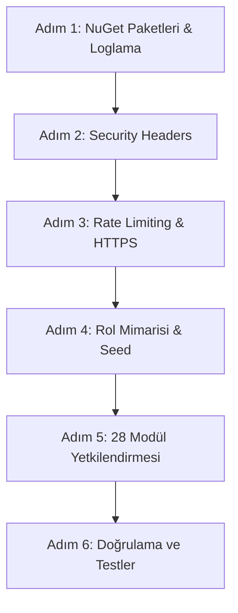

# Plan 17 — Production Güvenlik Sertleştirmesi (Güvenlik Duvarı, Rate Limiter ve Rol Tabanlı Yetkilendirme)

**Tarih:** 2026-05-30 · **Durum:** `Onay Bekliyor` · **Modül:** M00 (Güvenlik) · **Kaynak:** F0.2 (🔴 KRİTİK)

---

## 1. Problem
Operax internet ortamında herkese açık bir şekilde yayına alınmaya hazırlanıyor. Mevcut durumda uygulamada kimlik doğrulama bulunmasına karşın, internet üzerindeki saldırılara (brute-force, DDoS, clickjacking, XSS, yetkisiz modül erişimleri vb.) karşı yeterli koruma mekanizmaları mevcut değildir:
1. **Brute-Force & DDoS:** `/Auth/Login` ve `/api/switch-company` gibi kritik uçlarda istek sınırlaması (Rate Limiting) bulunmamaktadır. IP engelleme veya brute-force koruması yoktur.
2. **Eksik Güvenlik Header'ları:** Tarayıcı güvenliğini (CSP, Clickjacking, MIME-sniffing, vb.) yöneten hiçbir HTTP security header response'larda yer almamaktadır.
3. **Rol ve Erişim Yönetimi:** 28 adet ERP/WMS modülü bulunmasına rağmen rol tabanlı yetkilendirme (`[Authorize(Roles = ...)]`) aktif değildir; sisteme giriş yapan her kullanıcı tüm modüllere tam yetkiyle erişebilmektedir.
4. **Güvenlik Loglaması Eksikliği:** Olası saldırıları izlemek ve analiz etmek için yapılandırılmış (structured) IP/UserAgent loglama altyapısı bulunmamaktadır.

---

## 2. Scope
### Dahili
- **Rate Limiting:** ASP.NET Core yerleşik `Microsoft.AspNetCore.RateLimiting` ile global, login uçlu ve şirket değiştirme uçlu kısıtlama.
- **Security Headers:** `NetEscapades.AspNetCore.SecurityHeaders` paketi entegre edilerek OWASP uyumlu CSP, HSTS, X-Frame-Options, X-Content-Type-Options vb. uygulanması.
- **Rol Tabanlı Yetkilendirme (RBAC):** `Roles.cs` sabit sınıfının tanımlanması, 7 temel rolün `SeedData.cs` ile oluşturulması ve 28 modülün Details/Index sayfalarına uygulanması.
- **Admin Panel Koruması:** Hangfire dashboard ve `/Admin` klasörü erişiminin sadece `Administrator` rolü ile sınırlandırılması.
- **TLS & HTTPS Sertleştirmesi:** Cookie secure politikalarının `Always` yapılması ve HTTPS yönlendirmesinin zorunlu kılınması.
- **Yapılandırılmış Loglama:** Serilog + `Serilog.Enrichers.ClientInfo` entegrasyonu ile IP/UserAgent parametrelerinin otomatik loglanması.

### Dışı
- **OAuth / 2FA Entegrasyonu:** (İlerideki fazlarda değerlendirilecek).
- **IP Co-location / Geo-blocking:** Uygulama seviyesinde değil, Cloudflare (Edge) seviyesinde yönetilecektir.

---

## 3. Alternatifler & Kararlar

### A. Rate Limiting Tercihi
*   **Alternatif A.1 (AspNetCoreRateLimit NuGet):** Eskiden yaygındı ancak şu an maintenance modundadır ve .NET 7/8/9 uyumluluğu düşüktür.
*   **Alternatif A.2 (Yerleşik Microsoft.AspNetCore.RateLimiting - Seçilen):** Microsoft'un .NET 7 ile getirdiği yerleşik çözümdür. Pipeline üzerinde çok daha hızlı çalışır, harici paket bağımlılığı yaratmaz ve modern C# algoritmalarını (Fixed/Sliding Window, Token Bucket, Concurrency) destekler.

### B. Security Headers Tercihi
*   **Alternatif B.1 (NWebsec NuGet):** 2020'den beri güncellenmemiştir, modern .NET sürümleriyle uyumsuzdur.
*   **Alternatif B.2 (NetEscapades.AspNetCore.SecurityHeaders - Seçilen):** Andrew Lock tarafından geliştirilen, .NET 9 uyumlu ve aktif olarak bakımı yapılan en popüler güvenlik headers middleware'idir. CSP konfigürasyonunu fluent API ile yapmayı son derece kolaylaştırır.

### C. WAF & Bot Koruması Tercihi
*   **Alternatif C.1 (Özel IP Blacklist Middleware):** Sunucu üzerinde IP kontrolü yapmak hem maliyetlidir hem de DDoS karşısında sunucu kaynaklarını tüketir.
*   **Alternatif C.2 (Cloudflare Edge Integration - Seçilen):** Sunucunun önüne ücretsiz/pro Cloudflare WAF kurulması. L3/L4/L7 DDoS koruması sağlar, şüpheli istekleri ve bilinen botları sunucuya ulaşmadan bloklar. Sunucu kaynaklarını korur.

---

## 4. Done Criteria (DoD)
- [ ] `NetEscapades.AspNetCore.SecurityHeaders` ve `Serilog.AspNetCore` paketleri kuruldu.
- [ ] `/Auth/Login` post istekleri IP başına dakikada 10 istek ile sınırlandırıldı (429 Too Many Requests).
- [ ] Global rate limiter ile IP başına dakikada maksimum 200 istek limiti uygulandı.
- [ ] Clickjacking, MIME-sniffing ve XSS koruma header'ları response'lara başarıyla yansıtıldı.
- [ ] Content Security Policy (CSP) tanımlandı (Google Fonts ve Tailwind CDN whitelist'lendi).
- [ ] `Roles.cs` tanımlandı ve 7 rol (Administrator, WarehouseManager, Finance, Purchasing, Sales, Manufacturing, Viewer) veritabanına seed edildi.
- [ ] 28 modülün tamamında rol bazlı yetkilendirme (`[Authorize(Roles = ...)]`) test edildi ve doğrulandı.
- [ ] Hangfire panel ve `/Admin` klasörü sadece `Administrator` rolüne kapatıldı.
- [ ] Serilog yapılandırılarak `logs/operax-*.log` dosyasına IP ve UserAgent bilgileriyle log basılması sağlandı.
- [ ] `dotnet build` başarıyla sıfır hata ile tamamlandı.

---

## 5. Adımlar ve Yol Haritası



### Adım 1 — Paket Kurulumları & Loglama Mimarisi (Serilog)
*   Aşağıdaki NuGet paketlerini ekle:
    ```bash
    dotnet add package NetEscapades.AspNetCore.SecurityHeaders
    dotnet add package Serilog.AspNetCore
    dotnet add package Serilog.Enrichers.ClientInfo
    dotnet add package Serilog.Sinks.File
    ```
*   `Program.cs`'e `builder.Host.UseSerilog(...)` ekle. `WithClientIp()` ve `WithClientAgent()` enricher'larını aktif et. Logları günlük rotasyonlu JSON/Text olarak dosyaya yaz.

### Adım 2 — HTTP Security Headers Middleware Yapılandırması
*   `Program.cs`'de `HeaderPolicyCollection` nesnesini oluştur ve `app.UseSecurityHeaders()` olarak ekle.
*   CSP politikasını tanımla:
    ```csharp
    csp.AddDefaultSrc().Self();
    csp.AddScriptSrc().Self().UnsafeInline(); // Tailwind/CDN scriptleri için
    csp.AddStyleSrc().Self().UnsafeInline().From("https://fonts.googleapis.com");
    csp.AddFontSrc().Self().From("https://fonts.gstatic.com");
    ```

### Adım 3 — Rate Limiting & HTTPS Sıkılaştırma
*   `Program.cs`'de `builder.Services.AddRateLimiter(...)` çağır.
*   `/Auth/Login` POST ucu için IP bazlı 10 req/min FixedWindow politikasını tanımla.
*   Global limitlemeyi dakikada IP başına 200 istek olacak şekilde ekle.
*   `CookieSecurePolicy.Always` yaparak cookie'lerin yalnızca HTTPS üzerinden taşınmasını zorunlu kıl. HSTS süresini production ortamında 1 yıl (`max-age=31536000`) yap.

### Adım 4 — Rol Sabitleri ve SeedData Oluşturulması
*   `Lib/Roles.cs` içinde static string sabitleri oluştur:
    ```csharp
    public static class Roles
    {
        public const string Administrator = "Administrator";
        public const string WarehouseManager = "WarehouseManager";
        public const string Finance = "Finance";
        public const string Purchasing = "Purchasing";
        public const string Sales = "Sales";
        public const string Manufacturing = "Manufacturing";
        public const string Viewer = "Viewer";
    }
    ```
*   `Lib/SeedData.cs` sınıfını güncelleyerek bu 7 rolü `RoleManager` aracılığıyla veritabanında oluştur.

### Adım 5 — 28 ERP/WMS Modülünde Rol Bazlı Yetkilendirme (RB-3)
Aşağıdaki eşleştirme matrisine göre modüllerin Razor Page/Controller sınıflarını `[Authorize(Roles = ...)]` ile güncelle:

| Rol | Yetkili Modüller (Klasörler / Uçlar) |
|---|---|
| **Administrator** | Her şey, Hangfire `/admin/jobs`, `/Features/Admin/**` |
| **WarehouseManager** | `/Features/Warehouse/Receiving`, `Shipping`, `Transfer`, `Inventory`, `CycleCount`, `LPN`, `Lot`, `Picking` |
| **Finance** | `/Features/Finance/Payments`, `Loans`, `CreditCards`, `Cheques`, `Accounts`, `Aging`, `PaymentPlan`, `Snapshot` |
| **Purchasing** | `/Features/Purchasing/PurchaseOrders`, `/Features/Expenses`, `/Features/Budget` |
| **Sales** | `/Features/Sales/SalesOrders`, `/Features/SalesInvoices`, `/Features/Incentives` |
| **Manufacturing** | `/Features/Manufacturing/Production`, `BOM`, `WorkOrders`, `WorkCenters` |
| **Viewer** | Dashboard salt-okunur + MasterData okuma (`/Features/MasterData/Items` [Details/Index], `/Features/MasterData/Partners` [Details/Index]) |

### Adım 6 — Doğrulama ve Sızma Testi Simülasyonu
*   Farklı rollerde test kullanıcıları oluştur.
*   Her kullanıcının kendi yetki alanının dışına çıktığında `403 Forbidden` veya `AccessDenied` alıp almadığını kontrol et.
*   Login sayfasına 10'dan fazla istek göndererek `429 Too Many Requests` (Rate limit) durumunu doğrula.
*   Response header'larında `X-Frame-Options: DENY` ve `Content-Security-Policy` değerlerinin varlığını tarayıcı geliştirici araçlarından doğrula.

---

## 6. Onay
*   [ ] Gösterildi · [ ] Onay: <tarih>

---
> ⚠️ **UYARI (BAĞIMLILIKLAR):** 
> 1. Rol bazlı yetkilendirmenin doğru çalışabilmesi için `SeedData.cs` çalıştırılıp veritabanına bu rollerin eklenmesi şarttır.
> 2. `Program.cs`'de `app.UseRateLimiter()` middleware çağrısı, routing ve authentication middleware'lerinden sonra, ancak endpoint yönlendirmelerinden önce olmalıdır.
